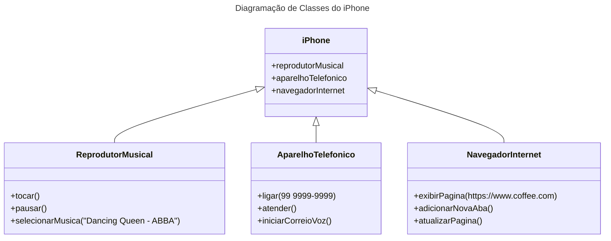

# Desafio de Projeto - POO

## Modelagem e Diagramação de um Componente iPhone

Nesse desafio a proposta foi elaborar um diagrama de classes e interfaces utilizando uma ferramenta UML e implementá-los em .java.

